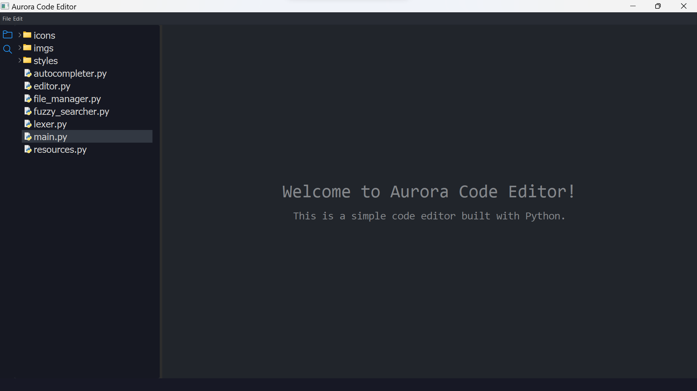

# Aurora Code Editor
This is a work in progress code editor built with Python.

To download **Aurora Code Editor** use the following command in your command line (git is required):

`git clone https://github.com/myferr/aurora-code-editor`

# Screenshot

# Requirements
jedi==0.18.1

PyQt5==5.15.7

QScintilla==2.13.3

# ToDo:
* Fix open file bugs
* Create a website for Aurora
* Fix syntax highlighting
